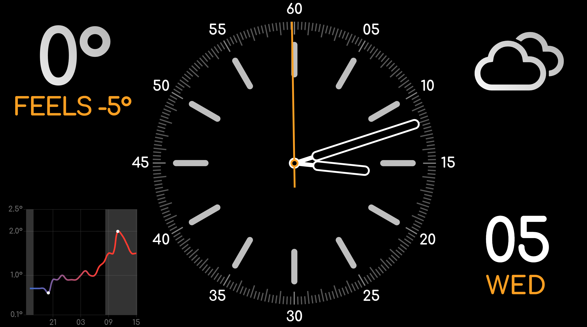

# Pi Weather Kiosk

A sleek and modern weather kiosk application designed for Raspberry Pi, featuring a beautiful analog clock, temperature display, weather conditions, forecast chart, and calendar display.



## Features

- ⏰ Beautiful analog clock with customizable display options
- 🌡️ Current temperature display
- 🌤️ Weather condition icons
- 📈 24-hour temperature forecast chart
- 📅 Calendar display with current date
- 🌓 Day/night cycle visualization in the forecast chart
- 🔄 Auto-updating weather data every 15 minutes

## Prerequisites

- Raspberry Pi (any model with web browser support)
- PHP-enabled web server (Apache or Nginx)
- Modern web browser
- Internet connection for weather data

## Installation

1. Clone this repository:
```bash
git clone https://github.com/yourusername/pi-weather-kiosk.git
cd pi-weather-kiosk
```

2. Configure your web server to serve the directory. For Apache, you can move it to `/var/www/html/`:
```bash
sudo mv pi-weather-kiosk /var/www/html/
```

3. Ensure proper permissions:
```bash
sudo chown -R www-data:www-data /var/www/html/pi-weather-kiosk
```

4. Access the kiosk through your web browser:
```
http://localhost/pi-weather-kiosk
```

## Configuration

### Updating Location

The weather data is fetched from Open-Meteo API. To change the location:

1. Open `weather.js`
2. Locate the `fetchWeather()` function
3. Update the latitude and longitude values in the API URL:
```javascript
const apiURL =
  "https://api.open-meteo.com/v1/forecast?" +
  "latitude=YOUR_LATITUDE&longitude=YOUR_LONGITUDE" +
  "&current=temperature_2m,is_day,weather_code" +
  "&hourly=temperature_2m" +
  "&daily=sunrise,sunset" +
  "&timezone=YOUR_TIMEZONE";
```

You can find your coordinates using [latlong.net](https://www.latlong.net/)

### Temperature Units

To switch between Celsius and Fahrenheit:

1. Open `weather.js`
2. In the `fetchWeather()` function, add the `temperature_unit` parameter:
```javascript
const apiURL =
  "https://api.open-meteo.com/v1/forecast?" +
  "latitude=YOUR_LATITUDE&longitude=YOUR_LONGITUDE" +
  "&current=temperature_2m,is_day,weather_code" +
  "&hourly=temperature_2m" +
  "&daily=sunrise,sunset" +
  "&temperature_unit=fahrenheit" + // Change to celsius for Celsius
  "&timezone=YOUR_TIMEZONE";
```

## Customization

### Clock Style

The clock face can be customized by modifying the class names in `index.php`. Available options include:

- Hour styles: `hour-style-pill`, `hour-style-text`, `hour-style-text-quarters`
- Hour text styles: `hour-text-style-large`, `hour-text-style-small`
- Minute styles: `minute-style-line`, `minute-style-dot`
- Hand styles: `hand-style-normal`, `hand-style-hollow`

### Theme Colors

Colors can be customized by modifying the CSS variables in `styles.css` and `weather.css`.

## Auto-start on Boot

To configure the kiosk to start automatically on boot:

1. Install Chromium browser if not already installed:
```bash
sudo apt install chromium-browser
```

2. Create an autostart script:
```bash
mkdir -p ~/.config/autostart
nano ~/.config/autostart/kiosk.desktop
```

3. Add the following content:
```ini
[Desktop Entry]
Type=Application
Name=Weather Kiosk
Exec=chromium-browser --kiosk --incognito http://localhost/pi-weather-kiosk
```

## Contributing

Contributions are welcome! Please feel free to submit a Pull Request.

## License

This project is licensed under the MIT License - see the [LICENSE](LICENSE) file for details.

## Acknowledgments

- Weather data provided by [Open-Meteo](https://open-meteo.com/)
- Weather icons by [Weather Icons](https://erikflowers.github.io/weather-icons/)
- Charts powered by [Chart.js](https://www.chartjs.org/)
- Apple watch face by [Thai Pangsakulyanont](https://codepen.io/dtinth/pen/JjmLob)